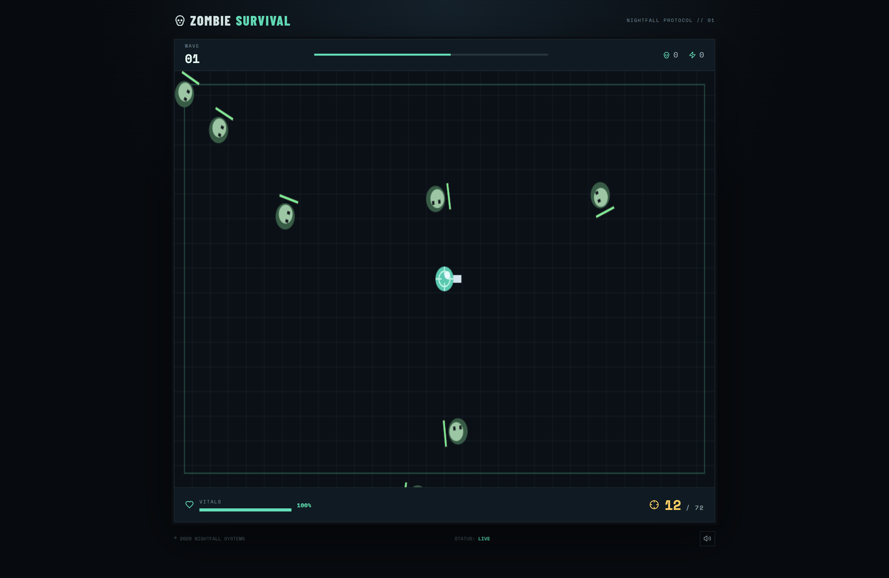

# 🧟 Zombie Survival

A fast-paced zombie survival game built with **React.js and Vite**, where players must survive endless waves of zombies, eliminate enemies, manage ammunition, and achieve the highest score possible.

Test your reflexes, survive the night, and become the last one standing!

---

## 🛠️ Technologies Used


---

## 📸 Screenshots

### Gameplay



---

## 🎮 Features

* 🧟 Survive multiple waves of zombies.
* 🔫 Aim and shoot using your mouse.
* 🎯 Automatic enemy spawning system.
* ❤️ Health and damage mechanics.
* 🔋 Ammunition and automatic reload system.
* 💊 Health pickups to recover vitality.
* 🏆 Score and kill tracking.
* 👾 Special elite zombies with increased health.
* 🌙 Immersive dark-themed survival interface.
* 🔄 Restart functionality after game over.
* 📱 Responsive game interface.

---

## 🕹️ Controls

| Action     | Control           |
| ---------- | ----------------- |
| Move Up    | W / Arrow Up      |
| Move Down  | S / Arrow Down    |
| Move Left  | A / Arrow Left    |
| Move Right | D / Arrow Right   |
| Aim        | Mouse             |
| Shoot      | Left Mouse Button |
| Shoot      | Spacebar          |

---

## 📂 Project Structure

```text
zombie-survival-vite/
│
├── public/
│
├── src/
│   ├── main.jsx
│   └── styles.css
│
├── index.html
├── package.json
├── package-lock.json
└── README.md
```

---

## ⚙️ Installation and Setup

### 1. Clone the Repository

```bash
git clone https://github.com/your-username/zombie-survival-vite.git
```

### 2. Navigate to the Project Directory

```bash
cd zombie-survival-vite
```

### 3. Install Dependencies

```bash
npm install
```

### 4. Start the Development Server

```bash
npm run dev
```

Open the local development URL displayed in your terminal.

---

## 📦 Build for Production

```bash
npm run build
```

To preview the production build:

```bash
npm run preview
```

---

## 🧠 Game Mechanics

### Wave System

Each wave introduces more zombies, increasing the difficulty as the player progresses.

### Combat

Players can aim using the mouse and shoot incoming zombies. Ammunition must be managed carefully.

### Health System

Zombies deal damage when they reach the player. Health pickups can restore lost health.

### Scoring

Players earn points by eliminating zombies, with elite zombies providing additional rewards.

---

## 🔮 Future Improvements

- Multiple weapons and weapon upgrades.
- Boss zombie encounters.
- Background music and sound effects.
- Local leaderboard and high-score persistence.
- Additional maps and environments.
- Mobile touch controls.
- Power-ups and special abilities.
- Multiplayer survival mode.

---

## 👨‍💻 Author

**Ajinkya Dhatrak**

GitHub: [ajinkya029](https://github.com/ajinkya029)

---

## 📄 License

This project is open-source and available for educational and personal use.

---

⭐ If you enjoyed the game, consider starring the repository!